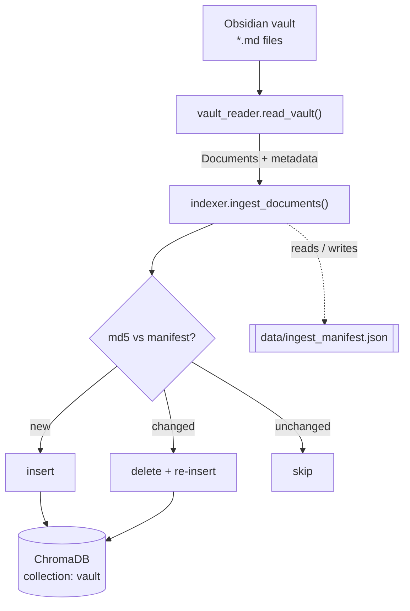
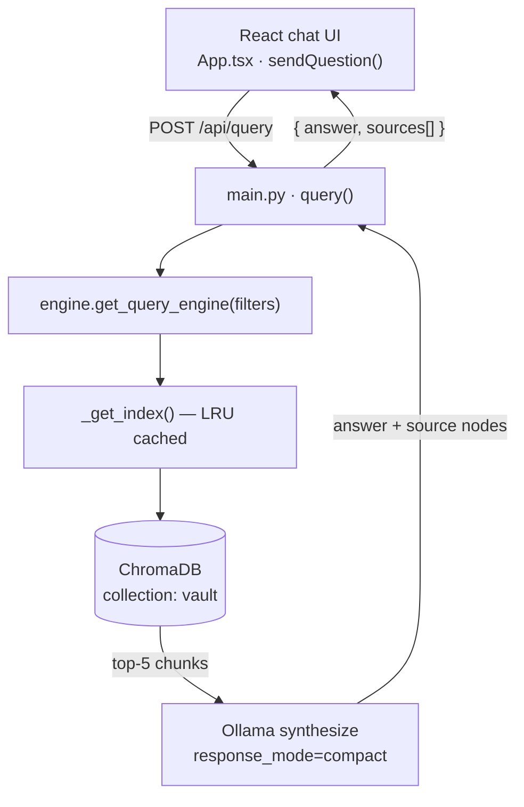

# Architecture

How SecondBrain turns an Obsidian vault into a conversational, cited Q&A system.
This doc traces the two data flows, the order to read the code, and the reasoning
behind the key design decisions.

> **Scope note:** everything below reflects code that exists today. The
> evaluation pipeline is on the [roadmap](#roadmap) and is called out as planned
> wherever it appears — it is not implemented yet.

## System at a glance

The backend is **two importable packages under `server/`** that depend on each
other, plus a React frontend and two external services (ChromaDB, Ollama):

- **`app/`** — the web layer: FastAPI routes (`main.py`) and settings (`config.py`).
- **`secondbrain/`** — the RAG core: `vault_reader.py`, `indexer.py`, `engine.py`,
  and the `ingest` CLI (`__main__.py`).
- **`client/`** — the React + TypeScript chat UI (`src/App.tsx`).

`app.main` imports from `secondbrain`, and `secondbrain` imports config from
`app.config`. Both packages run from the `server/` directory.

Work happens in two distinct flows: **ingestion** (offline, via the CLI) writes
the vault into the vector store, and **query** (online, via the API) reads it back
to answer questions.

## Ingestion pipeline — vault → vectors

Run with `python -m secondbrain ingest --vault-path <path>` (from `server/`).

1. **`vault_reader.read_vault()`** walks the vault for `*.md` (skipping
   `.obsidian` / `.trash`), and for each note parses YAML frontmatter
   (`tags`, `aliases`, `date`) and `[[wikilinks]]` into metadata, producing a
   LlamaIndex `Document`. Malformed frontmatter is tolerated — the note becomes
   plain text with no metadata.
2. **`indexer.ingest_documents()`** configures the embedding model and chunker,
   then for each document compares its md5 content hash against
   `data/ingest_manifest.json` to decide **add / update / skip**, and upserts the
   chunks into Chroma. The manifest is rewritten to reflect the new vault state.

## Query pipeline — question → grounded answer

1. **`App.tsx:sendQuestion()`** POSTs `{ question, filters? }` to `/api/query`.
   In dev, Vite proxies `/api` → `http://localhost:8000`, so no backend URL is
   hardcoded.
2. **`main.py:query()`** calls `engine.get_query_engine(filters)`, runs the query,
   and maps each retrieved node into a `Source` (`title`, `content_snippet`,
   `metadata`).
3. **`engine.get_query_engine()`** retrieves `similarity_top_k=5` chunks
   (optionally metadata-filtered), and Ollama synthesizes a grounded answer with
   `response_mode="compact"`.

There are four routes in total (`server/app/main.py`):

| Method & path | Purpose |
|---|---|
| `GET /api/health` | Liveness check |
| `GET /api/config` | Active `ollama_model` and `chroma_port` |
| `POST /api/query` | `{ question, filters? }` → `{ answer, sources[] }` |
| `GET /api/sources/{source_id}` | Reassemble a note's chunks by `title` (404 if none) |

## Read the code in this order

Follow the data, smallest to largest — not alphabetically:

| # | File | What it is |
|---|------|-----------|
| 1 | `server/app/config.py` | Every setting the system has (`pydantic-settings`). The vocabulary — start here. |
| 2 | `server/secondbrain/vault_reader.py` | Input parsing: frontmatter + wikilinks → `Document`s. |
| 3 | `server/secondbrain/indexer.py` | The heart: chunking, embedding, the incremental manifest. |
| 4 | `server/secondbrain/engine.py` | Retrieval + LLM wiring, metadata filters, the LRU cache. |
| 5 | `server/app/main.py` | The four HTTP routes and the Pydantic models. |
| 6 | `client/src/App.tsx` | How the UI calls the API and renders sources. |

## Design decisions (the "why")

**Two-package split (`app/` + `secondbrain/`).** Keeps the web layer separable
from the RAG core so the ingestion/query logic can be used from the CLI without
importing FastAPI. The one coupling — `secondbrain` reading `app.config` — keeps a
single source of settings.

**Incremental, idempotent ingest** (`indexer.ingest_documents`, `data/ingest_manifest.json`).
Embedding is the expensive step, so an md5 content-hash manifest lets re-runs
skip unchanged notes and only re-embed what changed. Deleting the manifest forces
a full re-ingest.

**Chunk size 512 / overlap 50** (`indexer.configure`, `SentenceSplitter`).
Chunks small enough to embed meaningfully and retrieve at useful granularity; the
50-token overlap keeps an idea from being split across a boundary. Too large →
noisy retrieval and wasted context; too small → fragments lose meaning.

**`similarity_top_k = 5`** (`engine.get_query_engine`). Enough supporting chunks
to answer without flooding the LLM's context with noise. A knob worth tuning once
the eval pipeline exists.

**`response_mode = "compact"`** (`engine`). Packs retrieved chunks into as few LLM
calls as possible instead of one call per chunk — fewer round-trips to Ollama.

**LRU-cached index** (`engine._get_index`, `@lru_cache`). The `VectorStoreIndex`
is built once per process for speed. Trade-off (and a common gotcha): **notes
ingested after the backend started aren't visible until it restarts.**

**Metadata filtering** (`engine._build_filters`). A plain dict like
`{"tags": "python"}` becomes LlamaIndex `MetadataFilters`, so retrieval is scoped
to matching notes. The UI exposes this as a title/tag filter.

**Local models, no API keys** (`config.py`). Ollama (`llama3.1`) for generation
and a local HuggingFace embedding model (`BAAI/bge-small-en-v1.5`). Buys privacy
(notes never leave the machine), zero per-query cost, and offline operation; the
trade-off is you run the models and quality is capped by the local model.

**ChromaDB as a separate service** (`docker-compose.yml`, host `:8001`). Decouples
vector storage from the API process so persistence and scaling are independent.

## Roadmap

- **Evaluation pipeline (planned):** score retrieval and answer quality —
  precision@k, recall@k, MRR, faithfulness, relevance — against annotated Q&A
  datasets. Not yet implemented.
